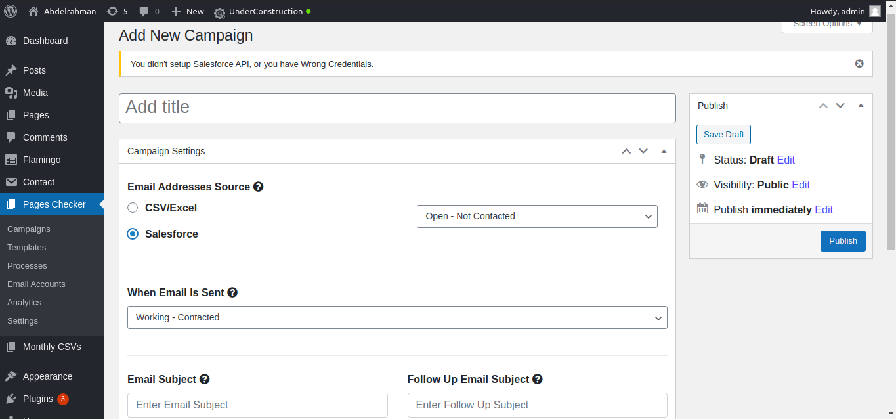

A WordPress plugin to help a client market his website.
The plugin consists of a form to upload an excel or csv file containing list of email addresses and urls, to send an email with a custom dynamic templates containing a report produced by an existing tool and other configurations.
And a lot more features, such as adding the option to get email addresses and websites from Salesforce.com, the ability to initiate different campaigns keeping each record separate, making use of SMTP and IMAP protocols to add the option of sending the emails using different accounts, and also adding an analysis feature that detects how well did the campaign/template do.

### Screenshots
### Old Plugin before adding the new features

#### Campaign

#### Templates

#### Processes

#### Email Accounts

#### Analytics

#### Settings

